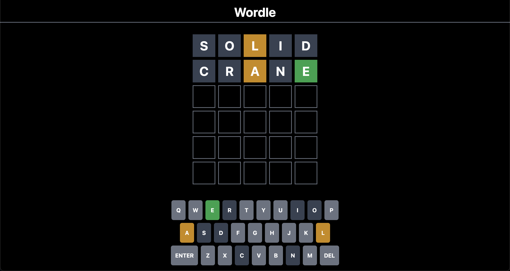

# [Wordle-Solid](https://wordle-solid.vercel.app)

A clone of a popular game [Wordle](https://www.nytimes.com/games/wordle/index.html), built with [Solid](https://www.solidjs.com/) and [Tailwind](https://tailwindcss.com/)

Please visit the website [here](https://wordle-solid.vercel.app)

## Developers' guide

In the project directory, you can run:

### `npm dev` or `npm start`

Runs the app in the development mode. 
Open [http://localhost:3000](http://localhost:3000) to view it in the browser.

The page will reload if you make edits. 

### `npm run build`

Builds the app for production to the `dist` folder. 
It correctly bundles Solid in production mode and optimizes the build for the best performance.

The build is minified and the filenames include the hashes. 
Your app is ready to be deployed!
